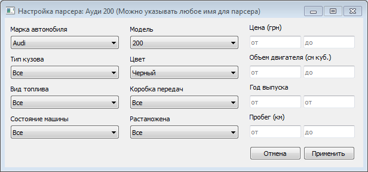
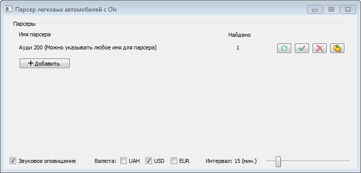
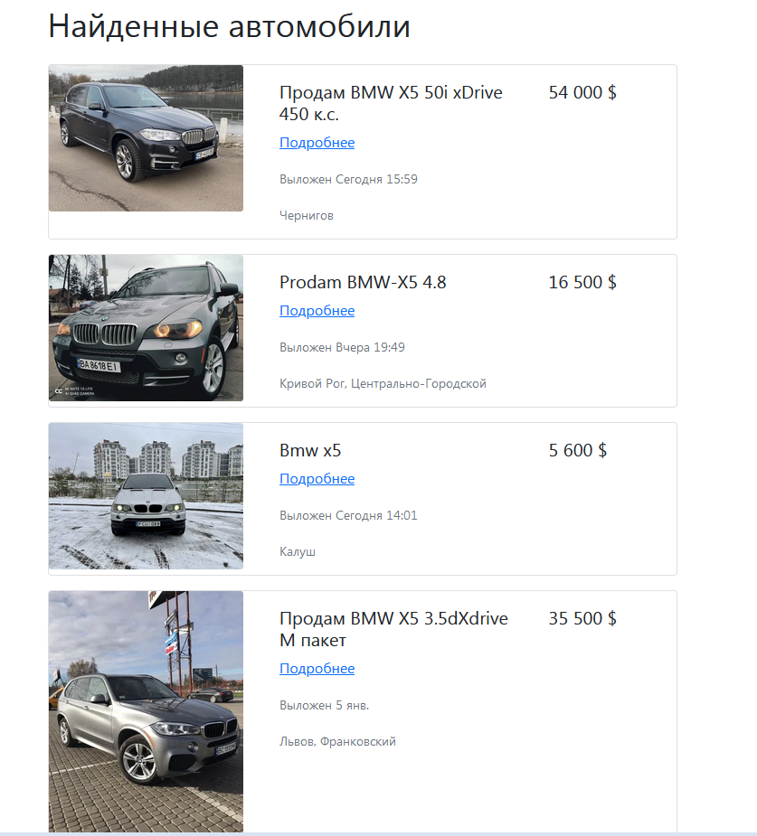

# Parser-for-cars-with-Olx


Коротко о программе
-------------------
<hr></hr>

С помощью данной программы можно автоматизировать поиск легковых автомобилей на сайте Olx.

Программа поддерживает все возможные настройки конфигурации автомобиля, предусмотреные данным сайтом.

Данные парсеров обновляются как автоматически (базовый интервал 15 минут) так и по нажатии кнопки "обновить парсер" 

Также, настройки парсера можно изменить в любое время.

**Одновременно можно создать семь парсеров.**

Для отображения найденных автомобилей нужно нажать правую крайнюю кнопку "просмотреть результаты".
Результаты отображаются в браузере.

**При запуске программа будет спрашивать разрешение для добавления себя в реестр. 
После добавления программы в реестр, при запуске ПК программа будет запускаться с параметром –hiden (без графического интерфейса) 
и обновляет парсеры с установленным интервалом.
После обновления всех парсеров, в нижнем правом углу экрана будут отображены плитки
с указанием имени парсера и количеством найденных автомобилей, нажав на которые, можно сразу просмотреть результаты в браузере.**

Скриншоты графического интерфейса
-------------------
<hr></hr>


Скриншот окна настроек:




Скриншот главного окна программы:



Скриншот результатов поиска:



Остальное
-------------------
<hr></hr>

В папке проекта есть файл requirements.txt в котором записаны все зависимости

Для установки зависимостей используйте команду: 
```pip install -r requirements.txt```
